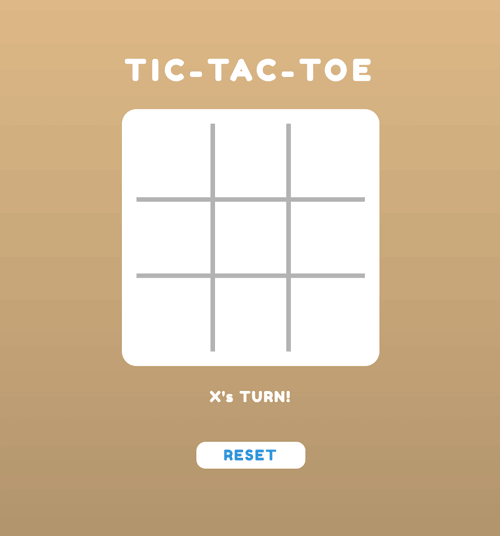

# Tic Tac Toe

In order to win the game, a player must place three of their marks in a horizontal, vertical, or diagonal row.
Players will soon discover that the best play from both parties leads to a draw. 

## How do we play Tic Tac Toe?

Players take turns playing: 
- 1st turn — Player 1: 
Player 1 places their token (X) in only 1 square of their choice
- 2nd turn — Player 2:
 Player 2 places their token (O) in only 1 square of their choice, except they can’t touch the square that Player 1’s token already fills
- 3rd turn- Player 1 …. and the cycle continues until a player wins or there’s a tie game

There are 8 winning combinations: Top row, Middle row, Bottom row, Left column, Middle column, Right column, Left diagonal, and Right diagonal
There’s a draw/tie when the entire board is filled with X’s and O’s but no winning combinations can be found.

## Screenshot



## Built With
 [RUBY](https://github.com/AymanJabr/Microverse-Tic-Tac-Toe-Ruby)

## Getting Started

This is an example of how you may give instructions on setting up your project locally. Modify this file to match your project, remove sections that don't apply. For example: delete the testing section if the currect project doesn't require testing.

- To get a local copy up and running follow these simple example steps.

- Clone this repository with git clone ```https://github.com/AymanJabr/Microverse-Tic-Tac-Toe-Ruby.git``` using your terminal or command line.
- Change to the project directory by entering :
```cd Microverse-Tic-Tac-Toe-Ruby``` in the terminal .
- run the command ```bin/main```

## Prequisites

Ruby installed.
Terminal / CMD.

## Authors

👤 Iddrisu Salley

- GitHub: [@juxsalley](https://github.com/juxsalley)
- Twitter: [@__salley](https://twitter.com/__salley)
- LinkedIn: [@Iddrisu Salley](https://www.linkedin.com/in/dev-salley/)

👤 Ayman Jabr

- GitHub: [@AymanJabr](https://github.com/AymanJabr)
- LinkedIn: [@Ayman Jabr](https://www.linkedin.com/in/ayman-jabr-3705a4100/)


## 🤝 Contributing

Contributions, issues, and feature requests are welcome!

Feel free to check the [issues page](https://github.com/AymanJabr/Microverse-Tic-Tac-Toe-Ruby/pull/3).

## Show your support

Give a ⭐️ if you like this project!

## 📝 License

This project is [MIT](LICENSE) licensed.