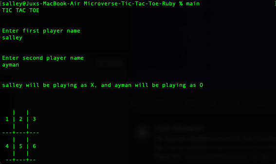

# Tic Tac Toe

In order to win the game, a player must place three of their marks in a horizontal, vertical, or diagonal row.
Players will soon discover that the best play from both parties leads to a draw. 

## How do we play Tic Tac Toe?

- The game is played on a grid that's 3 squares by 3 squares.
- You are player X, second player is O. Players take turns putting their marks in empty squares.
- The first player to get 3 of her marks in a row (up, down, across, or diagonally) is the winner.
- When all 9 squares are full, the game is over.


## Screenshot



## Built With
 [RUBY](https://github.com/AymanJabr/Microverse-Tic-Tac-Toe-Ruby)

## Getting Started

To get started with ````Tic Tac Toe```` you need to follow the intructions to be able to play it on your local machine.

- To get a local copy up and running follow these simple example steps.

- Clone this repository with ``` git clone https://github.com/AymanJabr/Microverse-Tic-Tac-Toe-Ruby.git``` using your terminal or command line.
- Change to the project directory by entering :
```cd Microverse-Tic-Tac-Toe-Ruby``` in the terminal .
- run the command ```bin/main```

## Prequisites

Ruby installed.
Terminal / CMD.

## Authors

👤 Iddrisu Salley

- GitHub: [@juxsalley](https://github.com/juxsalley)
- Twitter: [@__salley](https://twitter.com/__salley)
- LinkedIn: [@Iddrisu Salley](https://www.linkedin.com/in/dev-salley/)

👤 Ayman Jabr

- GitHub: [@AymanJabr](https://github.com/AymanJabr)
- LinkedIn: [@Ayman Jabr](https://www.linkedin.com/in/ayman-jabr-3705a4100/)


## 🤝 Contributing

Contributions, issues, and feature requests are welcome!

Feel free to check the [issues page](https://github.com/AymanJabr/Microverse-Tic-Tac-Toe-Ruby/pull/3).

## Show your support

Give a ⭐️ if you like this project!

## 📝 License

This project is [MIT](LICENSE) licensed.
